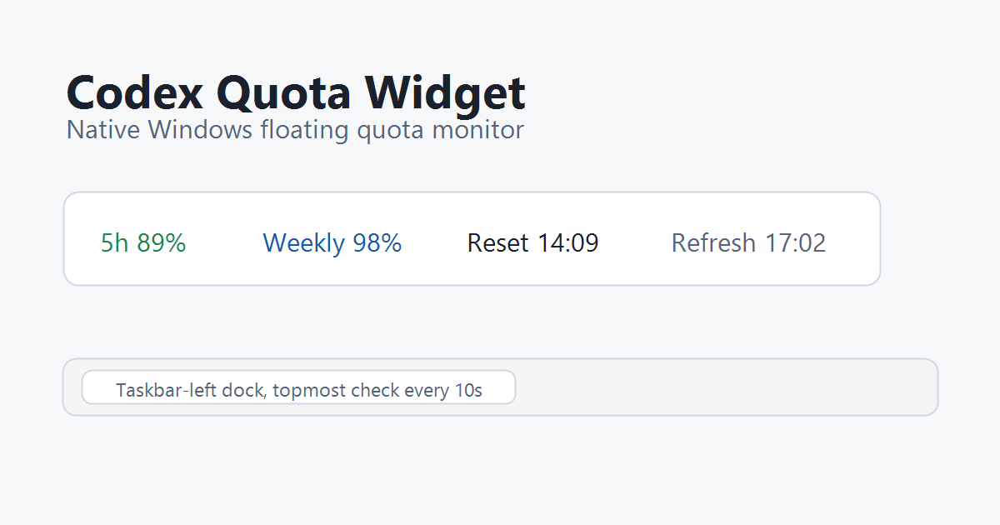
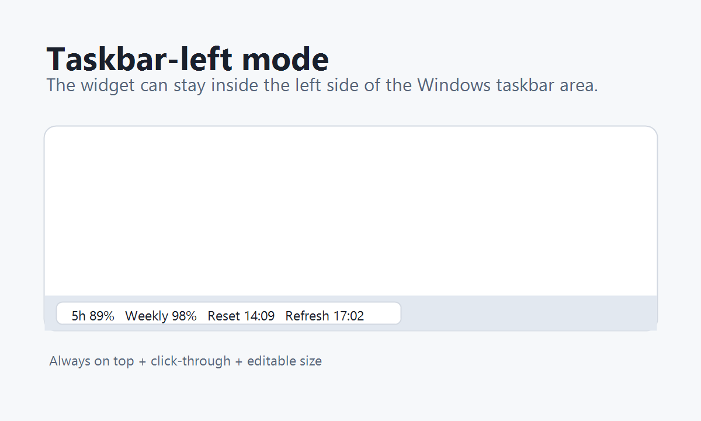
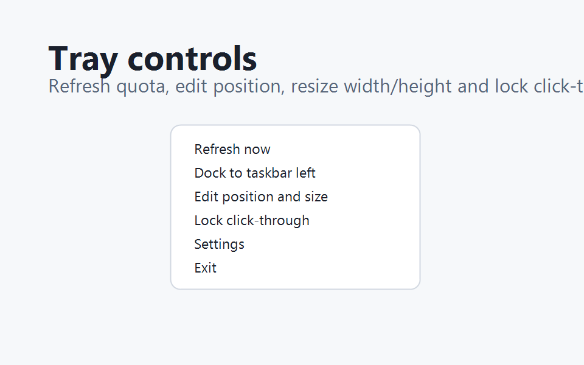

# Codex 额度小窗

一个适合 Windows 桌面的 Codex 额度显示小工具。它用原生 C# / .NET 8 / WPF 实现，不依赖 Electron、Chromium 或 WebView 常驻进程，适合长期放在桌面、任务栏左侧或角落里查看剩余额度。



## 主要功能

- 单行展示 Codex 当前返回的主额度窗口、重置时间、刷新时间等信息。
- 已适配 Codex 取消 `5小时` 窗口后的动态额度窗口显示。
- 支持吸附到 Windows 任务栏最左侧区域。
- 支持一直置顶，当前版本置顶检测间隔为 **10 秒**。
- 支持编辑位置、宽度和高度。
- 支持点击穿透，平时不影响鼠标操作。
- 支持托盘菜单快速刷新、显示/隐藏、编辑位置、锁定穿透和退出。
- 默认每 10 分钟自动获取一次额度，避免频繁调用。

## 下载使用

当前便携版 exe：

[下载 Codex额度小窗-1.0.0-portable-dynamic.exe](dist/Codex额度小窗-1.0.0-portable-dynamic.exe)

下载后双击运行即可。首次启动后会出现一个悬浮小窗，并在系统托盘显示图标。

## 使用示意





## 托盘菜单

右键系统托盘图标可以使用这些功能：

- `立即获取额度`：马上读取一次 Codex 额度。
- `吸附到任务栏最左边`：把小窗放入任务栏左侧区域。
- `编辑位置`：临时关闭点击穿透，可拖动小窗。
- `锁定穿透`：保存当前位置并恢复点击穿透。
- `设置`：调整置顶、透明度、字号、宽度等显示参数。
- `退出`：关闭小窗和托盘程序。

## 数据来源

程序通过本机 `codex app-server` 的 `account/rateLimits/read` 接口读取额度信息。

它不会读取浏览器 Cookie，不会读取 token，不会抓网页，也不会模拟键盘输入。

## 配置文件

配置、缓存和日志默认保存在：

```text
%APPDATA%\codex-quota-widget-native\
```

常见文件：

- `config.json`
- `usage.json`
- `logs\app.log`

## 构建

```powershell
dotnet build
```

发布便携版：

```powershell
.\scripts\publish-portable.ps1
```

## 版本说明

这个版本不再把主额度固定为 `5小时 / 本周`。如果 Codex 返回的是 `1天 / 本周` 或其他共享额度窗口，小窗会按实际窗口动态展示。置顶检测仍为 10 秒，额度自动获取仍默认每 10 分钟执行一次。

## 来源说明

本仓库是基于 `Davon-C/codex-quota-widget-native` 的本地优化版本继续修改而来，包含界面、任务栏贴靠、宽高编辑、置顶检测间隔等调整。发布和分发前请确认上游项目授权情况。
